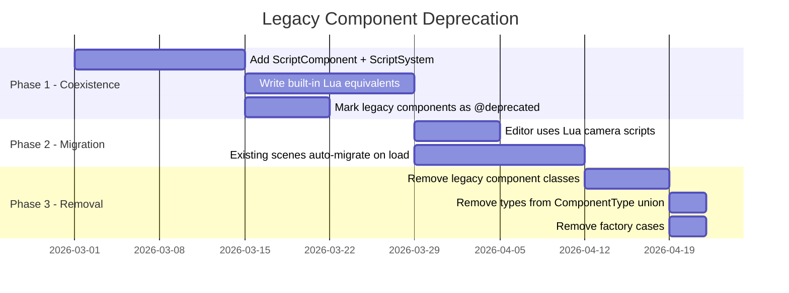

# Analysis: Generic Scripting Engine (Lua Sandbox) in ECS

## The Core Concept
Shifting from hardcoded logic components (like `FirstPersonMoveComponent`, `RaycastInteractionComponent`) to a **Generic Scripting Component** powered by Lua. In this architecture, designers and gameplay programmers write logic via a Web UI (like Monaco Editor in Next.js). This logic is serialized to a database, loaded into the client, and executed at runtime within the engine tick.

## Is it more powerful? Should we do it now?
**YES AND YES.**

This is exactly the inflection point that separates a "framework" from a true "Game Engine" (like Unity, Godot, or Roblox). 
Currently, adding a new behavior means:
1. Writing a new TypeScript component/system in `@duckengine/ecs`.
2. Re-compiling the Web-Core (Next.js) or client.
3. Adding a new React panel in the Editor to edit the properties of that component.

With a Scripting Engine:
1. You drag a `ScriptComponent` onto an Entity in the Web UI.
2. You write Lua code in the browser.
3. The engine instantly hot-reloads the script. You can share this logic dynamically via the database without ever recompiling the engine code.

It is highly recommended to start designing this **now**, because any complex gameplay interactions you build (like raycasting, inventory, taking damage, dialogues) will essentially be script domains. If you don't build the Lua layer now, you'll end up hardcoding 30-40 specific logic components that you will just have to rewrite in Lua later on.

## Architecture Proposal

### 1. The Scripting Context (Wasmoon vs Fengari)
We need a Lua sandbox running in the browser and Node (for SSR/Editor). Here is the evaluation of the two best options:

**[Wasmoon](https://github.com/ceifa/wasmoon)** (Recommended for Performance)
*   **Architecture:** Compiles the official Lua 5.4 C code to WebAssembly (WASM).
*   **Pros:** Much faster raw execution speed for Lua logic. 
*   **Cons:** Slightly larger footprint. Crossing the boundary between JS and WASM has a slight overhead. If a script calls thousands of JS functions per frame, this could add up.

**[Fengari](https://fengari.io/)** (Recommended for Deep Interop)
*   **Architecture:** A complete rewrite of the Lua 5.3 Virtual Machine in pure ES6 JavaScript.
*   **Pros:** Native JS Garbage Collection. Zero memory-leak risks when passing complex JS objects to Lua and vice-versa. Excellent DOM and JS interoperability. Smaller bundle size.
*   **Cons:** Slower raw execution speed (3x-6x slower than native JS or WASM) because it interprets Lua bytecodes in JS.

**Recommendation for SpaceDucksMMO:** 
I strongly lean towards **Wasmoon**. In a game engine, [update(dt)](file:///f:/Repos/SpaceDucksMMO/packages/core/src/infrastructure/scenes/BaseScene.ts#303-308) will run 60 times a second across multiple entities. We need the raw execution speed of WebAssembly for game math, pathfinding, or custom logic. We can mitigate the WASM-JS overhead by designing our API to minimize crossing the boundary (e.g., passing arrays of data instead of making a function call per property).

### 2. The `ScriptComponent`

This is the bridge between the Editor/ECS and the Lua logic. Based on your design constraints, a script should **not** have global access to the entire game world by default. Instead, it operates similarly to Unity's `MonoBehaviour` exposed fields, where you pass explicit references.

**The Structure:**
A `ScriptComponent` will hold a reference to the Lua asset (`scriptId`) and a dictionary of properties mapped to Editor fields.

```typescript
class ScriptComponent extends Component {
  scriptId: string; // E.g., "scripts/enemy_ai.lua"
  
  // Properties passed from the Editor to the Script Context
  properties: Record<string, ScriptProperty>;
}

// Allowed property types
type ScriptProperty =
  | { type: "number", value: number }
  | { type: "string", value: string }
  | { type: "entity_ref", value: string }      // ID of another entity (e.g., the Player)
  | { type: "component_ref", entityId: string, componentType: string } // Specific component
  | { type: "prefab_ref", prefabId: string };  // ID of a prefab to instantiate (e.g., a Bullet)
```

**How it works in practice:**
1. You create a reusable `turret.lua` script.
2. Inside `turret.lua`, you define metadata (this allows WebCore to generate the React UI in the Inspector):
   ```lua
   -- Metadata for the Editor (Web-Core)
   exports.properties = {
       target = { type = "entity_ref" },
       projectile = { type = "prefab_ref" },
       fireRate = { type = "number", default = 1.0 }
   }
   ```
3. In the Editor, you add `ScriptComponent` to an entity, assign `turret.lua`, and the Inspector automatically shows slots for `target` (where you drag the Player entity), `projectile` (where you select the Bullet prefab), and `fireRate`.

### 3. Safety and Context (The Lua Sandbox restrictions)

By injecting exactly what the script asked for, we restrict its domain. When [update(dt)](file:///f:/Repos/SpaceDucksMMO/packages/core/src/infrastructure/scenes/BaseScene.ts#303-308) is called, we pass these resolved references into the script. 

Instead of full global access, the script receives a `context` proxy object:

```lua
-- the 'props' table contains the resolved references passed by the Editor
function update(self, props, dt)
    local targetEntity = props.target
    
    if targetEntity then
        local dist = physics.distance(self.id, targetEntity.id)
        if dist < 10 then
            -- 1. Example: Modify self component based on target
            local selfTransform = self:getComponent("transform")
            selfTransform:lookAt(targetEntity.id)
            
            -- 2. Example: Instantiate a prefab
            if timeToShoot then
                local bullet = world.instantiate(props.projectile)
                bullet:setPosition(selfTransform.position)
            end
        end
    end
end
```

**Benefits of this approach:**
- **Encapsulation:** The script cannot randomly search the ECS wiping out entities. It only acts on what it has been explicitly given.
- **Reusability:** A `door_trigger.lua` can be reused on 50 doors, just by changing the `target` entity in the Editor Inspector.
- **Clear Inspector UI:** Because the Lua script declares its `properties`, the Next.js frontend knows exactly what UI inputs to render.

### 3. The `ScriptSystem`
The ECS system that iterates over all entities with `ScriptComponent`.
For each entity, the system ensures the Lua script is loaded and compiled. On each frame, it executes the [update(dt)](file:///f:/Repos/SpaceDucksMMO/packages/core/src/infrastructure/scenes/BaseScene.ts#303-308) function inside the Lua script context, passing a reference to the [Entity](file:///f:/Repos/SpaceDucksMMO/packages/core/src/infrastructure/scenes/BaseScene.ts#66-90).

```typescript
// Inside ScriptSystem.update()
for (const entity of scriptEntities) {
   // Sandbox execution: Call Lua function `update(entity, dt)`
   luaSandbox.call(entity.script.updateRef, entityProxy, dt);
}
```

### 4. Bridge / Bindings
This is the trickiest API design. The Lua sandbox needs safe "proxies" to the TypeScript ECS.
For security and performance, we don't pass raw TS objects to Lua. We expose a global API:
*   `transform.setPosition(entityId, x, y, z)`
*   `input.isKeyPressed("Space")`
*   `physics.applyImpulse(entityId, x, y, z)`
*   `raycaster.raycast(ndcX, ndcY)`

In the Lua script, the user writes something like:
```lua
function update(entity, dt)
    local state = input.getMouseState()
    
    -- If the user clicks
    if state.buttons.left then
        -- We will use the raycasting system we just designed!
        local hits = physics.raycastFromScreen(state.ndcX, state.ndcY)
        if #hits > 0 then
            logic.takeDamage(hits[1].entityId, 10)
        end
    end
end
```

### 5. Solving the Physics vs Transform Dilemma (API Design)
A classic problem in Game Engines is when a script tries to move an object (via `Transform:setPosition()`) while a Physics Engine (like Rapier or Ammo.js) is trying to control the same object via Rigidbodies. This leads to glitches, jittering, and objects clipping through walls.

**The Solution:** The Lua API should mirror the strict Component architecture. You don't "move an entity", you interact with its specific components.

#### Rule 1: Transform is for Kinematics/Statics
If an entity *only* has a `TransformComponent` (or is marked as Kinematic), Lua can move it directly. 
```lua
local transform = self:getComponent("transform")
-- Safe to do if there is no RigidBody, or if it's Kinematic
transform:setPosition(x, y, z) 
```

#### Rule 2: Physics Services for Dynamics
If the entity has a `RigidbodyComponent` (it is physically simulated), the script should **not** touch the transform. It must ask the `physics` global service or the rigidbody component to move it.

```lua
-- Example: A jump script
local rb = self:getComponent("rigidBody")
if rb then
    -- We apply an impulse. The Physics system will calculate the new position
    -- and the Engine will automatically sync the TransformComponent next frame.
    physics.applyImpulse(self.id, 0, 10, 0)
else
    print("Warning: Jump script requires a RigidBody!")
end
```

#### Rule 3: The "Teleport" Exception
Sometimes you *do* need to teleport a Physics object instantly (e.g., respawning). The Engine's Physics system usually provides a specific method for this that overrides the simulation. We expose this explicitly in the Lua API so the intent is clear:
```lua
-- This tells the Physics engine: "I know you are simulating this, but FORCE its position here"
physics.teleport(self.id, spawnX, spawnY, spawnZ)
```

By strictly dividing the API this way and providing EmmyLua typings (`---@class RigidBodyComponent`), the scripter knows exactly which domain they are interacting with, preventing desync bugs.
Lua natively is a dynamically typed language (like JavaScript). However, providing a typed API and autocomplete in our Web Editor is crucial for a good developer experience. We have a few options to achieve this:

#### Option A: EmmyLua Annotations (Recommended)
We can keep standard Lua 5.4 but use **EmmyLua** comments to type our API. In the Next.js editor, we configure the **Monaco Editor** with a Lua Language Server (LSP) that understands these annotations.
We would generate a `.d.lua` (declaration file) containing our Engine's API:

```lua
---@class Transform
---@field position {x: number, y: number, z: number}
---@field setPosition fun(self: Transform, x: number, y: number, z: number)
---@field lookAt fun(self: Transform, entityId: string)

---@class EntityProxy
---@field id string
---@field getComponent fun(self: EntityProxy, name: string): any
```
When the user types `self:getComponent("transform"):` in the Monaco Editor, they will instantly get autocomplete for `setPosition` and `lookAt`.

#### Option B: Luau (Roblox's Typed Lua)
Luau is a fast, statically typed derivative of Lua created by Roblox. It introduces syntax like `function update(entity: EntityProxy, dt: number)`. It is incredibly powerful but has a slightly different syntax than standard Lua and might require compiling Luau to Wasmoon, which adds tooling complexity.

#### Option C: TypeScriptToLua (tstl)
Instead of writing Lua, users write TypeScript in the Monaco Editor. We then run `tstl` (TypeScriptToLua) in the background to compile their TS into Lua, and we send *that* Lua to Wasmoon. This gives 100% perfect typing, but removes the "simplicity" of Lua.

**Recommendation:** Go with **Option A (EmmyLua + Monaco LSP)**. It keeps the runtime simple (just pass standard Lua to Wasmoon), but gives the user a magical, fully-typed Intellisense experience in the browser while they code.

### 6. Script Validation & Error Handling
A critical part of a Scripting Sandbox is ensuring that a bad script (e.g., a typo or an infinite loop) doesn't crash the entire Next.js Web-Core or the game server.

Validation happens at two stages:

#### Stage 1: Editor/Save Time (Syntax Validation)
When the user writes Lua code in the Monaco Editor and hits "Save", we do a dry-run parse before saving it to the database/resource catalog.
*   **How:** We use Wasmoon or a lightweight Lua parser in JS (like `luaparse`) to check for syntax errors. 
*   **Result:** If the code is missing an [end](file:///f:/Repos/SpaceDucksMMO/packages/rendering-three/src/infrastructure/rendering/ThreeRendererBase.ts#39-40) or has invalid syntax, the Editor shows a red error and prevents the script from saving. This ensures no broken code is ever persisted to the engine.

#### Stage 2: Runtime Execution (The `pcall` Sandbox)
Even if the syntax is correct, a script can fail at runtime (e.g., trying to access a `nil` reference, division by zero, etc.). 
In Lua, if an error happens normally, it stops the entire program. We **cannot** allow a single Entity's script to stop the entire engine loop.

*   **How:** The `ScriptSystem` will execute the [update(dt)](file:///f:/Repos/SpaceDucksMMO/packages/core/src/infrastructure/scenes/BaseScene.ts#303-308) functions using Lua's **protected call** (`pcall`).
*   **Mechanism:**
    ```lua
    -- Inside the Engine's JS to Lua Bridge:
    local success, err = pcall(function()
        userScript.update(entity, props, dt)
    end)
    
    if not success then
        -- We trap the error, the engine keeps running!
        engine.logScriptError(entity.id, err)
        -- We optionally disable this specific script component so it doesn't spam errors every frame
        engine.disableScript(entity.id)
    end
    ```

#### Stage 3: The Infinite Loop Problem (Instruction Limits)
What if a user writes `while true do end`? This would freeze the WASM thread and crash the browser tab.
*   **How:** Wasmoon/Lua allows setting a "Hook" (instruction limit). We can configure the Lua VM to throw a timeout error if a single script executes more than `100,000` instructions in a single frame. This guarantees the engine **always** recovers from bad user code.

### 7. Execution Order & Conflict Resolution
A very common scenario: You have two scripts on the same Entity (or different Entities) trying to modify the exact same component property (e.g., both scripts try to set `Transform:setPosition()`).

How do we handle priority and conflicts? We apply three standard Game Engine rules:

#### 1. Last Write Wins (Deterministic Execution Order)
In an ECS, systems run sequentially. If an Entity has an Array of `ScriptComponents` attached, they execute in the order they are defined in the Array (which can be reordered by the User in the Editor UI).
*   Script A runs and sets `player.vida = 100`
*   Script B runs in the same frame and sets `player.vida = 0`
*   **Result:** The player has 0 vida. "Last write wins". The execution order is deterministic and controlled by the Designer.

#### 2. Additive Mutations instead of Absolute Defines
To prevent the "Last Write Wins" from causing bugs (e.g., Script A sets MoveSpeed to 5, Script B sets it to 2, causing the character to stutter), we encourage (via API design) **additive** changes rather than absolute sets when dealing with continuous variables.

**Bad (Conflict prone):**
```lua
-- Script A overrides B
transform:setPosition(x, y, z + speed * dt) 
```

**Good (Additive):**
```lua
-- Both scripts add their intended motion vectors 
transform:translate(0, 0, speed * dt)
```

#### 3. Execution Phases (EarlyUpdate, Update, LateUpdate)
Just like Unity, not all logic should run in the exact same phase of the engine loop. We allow Lua scripts to define specific lifecycle functions. 

```lua
-- 1. Runs before physics and before standard updates. Ideal for reading Input.
function earlyUpdate(self, props, dt) end 

-- 2. Standard game logic
function update(self, props, dt) end 

-- 3. Runs AFTER all scripts and physics have finished. Ideal for Camera tracking.
function lateUpdate(self, props, dt) end 
```
If Script A controls the player's position in [update()](file:///f:/Repos/SpaceDucksMMO/packages/core/src/infrastructure/scenes/BaseScene.ts#303-308), and Script B makes the Camera follow the player, Script B should use `lateUpdate()`. This guarantees the Camera reads the *final* position of the player without any 1-frame jitter/lag.

### 8. State Persistence and Cross-Script Communication
When building a game, scripts need to manage state (like Player Health, Score, or Inventory) and communicate with each other. If everything is just a local Lua variable, the data dies when the script restarts and cannot be read by other systems (like the UI).

Here are the 3 ways to manage data in this architecture:

#### A. Internal Script State (Local Variables)
If the data is completely private to the script (e.g., `timeSinceLastShot`), it lives inside the Lua state.
```lua
-- Runs once when the component is created
function init(self, props)
    self.state.cooldown = 0
end

function update(self, props, dt)
    self.state.cooldown = self.state.cooldown - dt
end
```
*   **Pros:** Very fast.
*   **Cons:** Invisible to the rest of the Engine and UI. Drops if the VM reloads.

#### B. The `MetadataComponent` (Key-Value Entity State)
For data that defines the Entity (like **Health**, **MaxHealth**, **Mana**) and needs to be read by other scripts or displayed on the React UI, we introduce a generic `MetadataComponent` (or `TagsComponent`).

```typescript
// En TypeScript (ECS)
class MetadataComponent extends Component {
    data: Record<string, any> = {};
}
```

Now, any script can read or write to this shared Key-Value store:
```lua
-- Script 1: DamageTaker.lua
function takeDamage(self, amount)
    local meta = self:getComponent("metadata")
    meta:set("health", meta:get("health") - amount)
end

-- Script 2: HealthBarUI.lua
function update(self, props, dt)
    local targetMeta = props.target:getComponent("metadata")
    ui.updateHealthBar(targetMeta:get("health"))
end
```
*   **Pros:** Cross-script communication. The TS Engine can easily serialize this component to save the player's game to the database.

#### C. Global Game State (The [Scene](file:///f:/Repos/SpaceDucksMMO/packages/rendering-three/src/infrastructure/rendering/ThreeRendererBase.ts#269-290) Data)
What about global variables like `Score`, `TimeOfDay`, or `WaveNumber`?
Instead of attaching this to a specific Entity, the [Scene](file:///f:/Repos/SpaceDucksMMO/packages/rendering-three/src/infrastructure/rendering/ThreeRendererBase.ts#269-290) itself should hold a global Key-Value store (or a "Singleton Entity" called `GameManager`).

```lua
-- Any script from anywhere can access Scene globals
function onEnemyDeath()
    local currentScore = scene:getGlobal("score")
    scene:setGlobal("score", currentScore + 10)
end
```

**Can a Script reference another Script directly?**
Generally, **no**. In ECS, passing a direct function reference from `ScriptA.lua` to `ScriptB.lua` breaks decoupling. 
If Script A wants Script B to know something, it should:
1. Fire an Event: `engine.fireEvent("PlayerTookDamage", {amount = 10})`
2. Or change a value in the `MetadataComponent` that Script B is reading.
2. Or change a value in the `MetadataComponent` that Script B is reading.

### 9. Script Storage & Editor Integration (Resource Management)
How do we store these Lua files so they can be reused across entities and scenes, and how does the Next.js Editor UI handle them?

In SpaceDucksMMO, scripts should be treated exactly like **Textures** or **Materials**. They are **Resources**.

#### 1. The `ScriptResource` (Database / Asset Level)
We introduce a new Resource Type in your backend (Supabase/DB): `ResourceType.SCRIPT`.
A Script Resource contains:
*   [id](file:///f:/Repos/SpaceDucksMMO/packages/core/src/infrastructure/scenes/BaseScene.ts#15-16): `res_script_xyz123`
*   `name`: "Enemy AI Core"
*   `content`: The actual `.lua` string code.
*   `metadata`: The extracted `exports.properties` (so the UI can build the inspector without parsing Lua on the fly).

#### 2. The Editor UI Flow (Next.js)
1. **Resource Browser:** We add a "Scripts" tab to your Content Browser (where you currently have Models/Textures).
2. **Script Editor:** Clicking a Script Resource opens a Monaco Editor modal to edit the code.
3. **Inspector Panel (The Magic):** 
   When you select an Entity in the scene and attach a `ScriptComponent`, you see a dropdown to select a `ScriptResource`.
   Once selected, the Next.js UI reads the `metadata.properties` of that resource to generate the UI fields recursively:

**Example Flow in the UI:**
You select "Enemy AI Core" for the `ScriptComponent`. The UI sees this metadata:
```json
{
  "properties": {
    "speed": { "type": "number", "default": 5 },
    "target": { "type": "entity_ref" },
    "onDeathEvent": { "type": "string", "default": "GAME_OVER" }
  }
}
```
The Next.js Inspector instantly renders:
*   An `InputNumber` for `speed` (Default 5).
*   An `EntitySelectDropdown` for `target` (Allows you to pick an entity from the current scene hierarchy).
*   A `TextInput` for `onDeathEvent`.

When you hit "Save Scene", the `ScriptComponent` state serialized into the Scene JSON looks like this:
```json
"components": {
  "script": {
    "scriptId": "res_script_xyz123",
    "properties": {
      "speed": 8,
      "target": "ent_player_01",
      "onDeathEvent": "BOSS_DEFEATED"
    }
  }
}
```

#### 3. Reusability and Instantiation
Because the *logic* (the script resource) is decoupled from the *data* (the component properties), you can attach `res_script_xyz123` to **50 different enemies** in the scene.
*   Enemy 1 might have `speed: 2`, `target: ent_player_01`.
*   Enemy 2 might have `speed: 10`, `target: ent_door_05`.

When the Engine loads the scene, the `ScriptSystem` only needs to compile `res_script_xyz123` **once** in the Wasmoon VM. Then, every frame, it simply invokes that compiled function 50 times, passing the specific `properties` and `entityId` for each enemy.

### 10. Editor Scripts (Making the Editor Scriptable)
Your idea of using Lua to extend the Editor itself is brilliant and exactly how Unity works (`[ExecuteInEditMode]`).

When you are in the Next.js Scene Editor, the game's core loop (ECS) is usually paused, but the renderer and entity hierarchy are active. 

To allow "Editor Scripts" (scripts that run while you are building the scene, not just when playing):

#### 1. The `@runInEditor` flag
We introduce a flag in the Lua script metadata:
```lua
exports.properties = { ... }
exports.runInEditor = true -- Allow this script to execute in the Editor UI
```

#### 2. The `EditorSandbox` instance
The Next.js Editor will instantiate a **separate** Wasmoon VM (the `EditorSandbox`). This ensures Editor scripts don't pollute the actual Game Sandbox.
When the ECS detects a `ScriptComponent` with a resource that has `runInEditor = true`, it compiles and runs that script in the Editor Sandbox.

#### 3. What is this useful for?
**A. Procedural Generation (Level Design Tools):**
Imagine you want to place 50 trees in a circle computationally instead of dragging them one by one. You create a `TreeCircleGenerator.lua` with `runInEditor = true`, attach it to an Entity, change the "Radius" property in the React UI, and the script immediately instantiates the 50 trees in the Editor's scene view.

**B. Custom Gizmos & Helpers:**
We can expose a specific Editor API to Lua: `editor.drawLine(start, end, color)`. 
If you are programming a "Waypoints" system for enemy AI, the Lua script can use `editor.drawLine` in its [update](file:///f:/Repos/SpaceDucksMMO/packages/core/src/infrastructure/scenes/BaseScene.ts#303-308) function so you visually see the patrol paths while building the scene.

**C. Editor Camera Control:**
As you mentioned, your Editor Camera could literally be just a standard Entity with an `EditorCamera.lua` script attached! You wouldn't need hardcoded React/TS logic for the camera; the Lua script could listen to WASD + Mouse and move the Entity, and the renderer mounts to that Entity.

**Implementation note:** Editor Scripts must be severely restricted from modifying global database state, as they execute just by viewing the scene.

## ECS Design Conflicts & Required Changes

After auditing the `@duckengine/ecs` and `@duckengine/core` packages, we identified **4 design points** that must be addressed before (or during) the Lua scripting implementation. Two of these are true architectural conflicts, one is a deprecation strategy, and one is an API design concern.

---

### Conflict 1: `Map<ComponentType, Component>` — Only One Component Per Type ✅ Confirmed

**Where:** [Entity.ts](file:///f:/Repos/SpaceDucksMMO/packages/ecs/src/domain/ecs/core/Entity.ts#L34) — `private components = new Map<ComponentType, Component>();`

**Problem:**
The Entity class stores components in a `Map` keyed by `ComponentType`. This means you **cannot attach two `ScriptComponent`s to the same entity**. This directly contradicts Section 7 of this document ("Execution Order & Conflict Resolution"), which describes multiple scripts on the same entity.

**Impact:** 🔴 HIGH — Foundational blocker for script composability.

**Solution — Slot-based ScriptComponent (confirmed):**
The `Entity` keeps its `Map<ComponentType, Component>` unchanged. A single `ScriptComponent` internally manages an ordered list of `ScriptSlot[]`. The `ScriptSystem` iterates the slots within each `ScriptComponent`.

```typescript
class ScriptComponent extends Component {
  readonly type = 'script' as ComponentType;
  private scripts: ScriptSlot[] = [];
  // Each slot: { scriptId, properties, enabled, luaState }
}
```

This preserves 100% backward compatibility with no changes to Entity, and aligns naturally with the snapshot format (a single component entry with an array inside).

> [!NOTE]
> The `ScriptComponent` also acts as the **only** logic component type going forward. See "Legacy Component Deprecation" below for the migration strategy.

---

### Implementation Task: Extend `ComponentType` and `ComponentFactory`

This is not a conflict per se — it's straightforward implementation work:

1. Add `| "script"` and `| "metadata"` to the [ComponentType](file:///f:/Repos/SpaceDucksMMO/packages/ecs/src/domain/ecs/core/ComponentType.ts) union.
2. Add corresponding cases to [ComponentFactory.create()](file:///f:/Repos/SpaceDucksMMO/packages/ecs/src/domain/ecs/core/ComponentFactory.ts#L213-L334).
3. In `listCreatableComponents()`, always include `"script"` — it should be available on any entity regardless of other components.
4. Eventually, **remove** the deprecated logic component types from both (see deprecation plan below).

**Difficulty:** 🟢 Low

---

### Conflict 2: Legacy Logic Components → Replaced by Built-in Lua Scripts

This is the biggest architectural shift. The current engine has **6 hardcoded logic components** that embed behavior directly in TypeScript:

| Component | Location | What it does |
|-----------|----------|--------------|
| [FirstPersonMoveComponent](file:///f:/Repos/SpaceDucksMMO/packages/ecs/src/domain/ecs/components/FirstPersonMoveComponent.ts) | `components/` | WASD movement via `update(dt)` |
| [FirstPersonPhysicsMoveComponent](file:///f:/Repos/SpaceDucksMMO/packages/ecs/src/domain/ecs/components/FirstPersonPhysicsMoveComponent.ts) | `components/` | WASD + Physics (RigidBody impulses) |
| [MouseLookComponent](file:///f:/Repos/SpaceDucksMMO/packages/ecs/src/domain/ecs/components/MouseLookComponent.ts) | `components/` | Mouse look (pitch/yaw) |
| [OrbitComponent](file:///f:/Repos/SpaceDucksMMO/packages/ecs/src/domain/ecs/components/OrbitComponent.ts) | `components/` | Orbit around target entity |
| [LookAtEntityComponent](file:///f:/Repos/SpaceDucksMMO/packages/ecs/src/domain/ecs/components/LookAtEntityComponent.ts) | `components/` | Face a target entity |
| [LookAtPointComponent](file:///f:/Repos/SpaceDucksMMO/packages/ecs/src/domain/ecs/components/LookAtPointComponent.ts) | `components/` | Face a world point |

> [!NOTE]
> `LensFlareComponent` and `PostProcessComponent` are **NOT deprecated** — they are rendering data components (like materials/lights), not behavior logic. They don't contain gameplay `update()` logic; they configure the render pipeline.

**The Plan:** All behavior components (those with gameplay logic in `update(dt)`) will be **deprecated and eventually removed**. Their logic will be rewritten as **built-in Lua scripts** shipped with the engine as default `ScriptResource`s.

#### Why this is the right move

1. **No more hardcoded behavior in TypeScript.** Every gameplay behavior becomes a script that can be inspected, modified, and forked by the user.
2. **The Scene Editor itself benefits.** The editor's camera (orbit, fly, pan) becomes a Lua script (`editor_camera.lua`) attached to a hidden camera entity. This makes the editor extensible with the same scripting system.
3. **The engine ships with a "standard library" of scripts** — `first_person_move.lua`, `mouse_look.lua`, `orbit_camera.lua`, `look_at.lua` — that users can assign from a dropdown or use as templates for their own.
4. **The ComponentType union shrinks** over time instead of growing. We remove `firstPersonMove`, `firstPersonPhysicsMove`, `mouseLook`, `orbit`, `lookAtEntity`, `lookAtPoint` from the union. The only logic type left is `script`.

#### Migration Strategy



**Phase 1 — Coexistence:** Both systems work simultaneously. Legacy components still run via `Entity.update(dt)`. Scripts run via the `ScriptSystem`. Existing scenes are unaffected.

**Phase 2 — Migration:** Scene deserialization detects legacy component types (e.g., `"firstPersonMove"`) and auto-converts them into a `ScriptComponent` slot pointing to the equivalent built-in script (`builtin://first_person_move.lua`) with matching properties. The editor's own camera switches to the Lua version.

**Phase 3 — Removal:** Legacy component classes, their `ComponentType` values, and their factory cases are deleted. The `Entity.update()` loop may even become a no-op for logic (only the `ScriptSystem` drives behavior), simplifying the architecture.

> [!IMPORTANT]
> Components that are **pure data holders** (geometry, materials, lights, colliders, rigidBody, transforms) are **NOT deprecated**. Only components that contain `update()` logic are replaced by scripts. The ECS remains the source of truth for entity structure; Lua scripts are the source of truth for entity behavior.

---

### Conflict 3: Game Loop Phases (earlyUpdate / update / lateUpdate)

**Where:** [Entity.ts](file:///f:/Repos/SpaceDucksMMO/packages/ecs/src/domain/ecs/core/Entity.ts#L229-L235) `update(dt)` and [BaseScene.ts](file:///f:/Repos/SpaceDucksMMO/packages/core/src/infrastructure/scenes/BaseScene.ts#L303-L307) `update(dt)`

**Problem:**
The current loop is a flat `entities.update() → physics.update() → renderSync.update()`. There's no concept of execution phases. The scripting model (Section 7.3) needs `earlyUpdate → update → lateUpdate` to avoid issues like camera jitter and input latency.

**Impact:** 🔴 HIGH — Affects the entire game loop.

**Solution:**
The `ScriptSystem` owns the phased loop. `ScriptComponent.update(dt)` is a **no-op** — all execution is driven by the system. `BaseScene.update()` becomes:

```typescript
update(dt: number): void {
    this.scriptSystem?.earlyUpdate(dt);  // input reading, state setup
    this.physicsSystem?.update(dt);      // physics simulation
    this.scriptSystem?.update(dt);       // main game logic
    this.scriptSystem?.lateUpdate(dt);   // camera follow, UI sync
    this.renderSyncSystem?.update(dt);   // push to renderer
}
```

During Phase 1 (coexistence), legacy components still run via the old `ent.update(dt)` call, inserted before `physicsSystem`:
```typescript
// Phase 1 only — removed after legacy deprecation
for (const ent of this.entities.values()) ent.update(dt);
```

**Difficulty:** 🟡 Medium

---

### Conflict 4: Global Service Singletons vs Lua Sandbox Isolation

**Where:** [InputContext.ts](file:///f:/Repos/SpaceDucksMMO/packages/ecs/src/domain/ecs/core/InputContext.ts) and [PhysicsContext.ts](file:///f:/Repos/SpaceDucksMMO/packages/ecs/src/domain/ecs/core/PhysicsContext.ts)

**Problem:**
`InputServices` and `PhysicsApi` are global singletons via `Symbol.for()`. The Lua bridge needs controlled access to these. The `EditorSandbox` (Section 10) should be restricted from sending physics commands in edit mode.

**Impact:** 🟡 MEDIUM — Not a blocker, but a security/architecture concern.

**Solution:**
1. Lua bridge **wraps** the global services with validation and sandbox restriction checks.
2. `EditorSandbox` gets a restricted bridge that disables physics writes.
3. Long-term: move to dependency-injected contexts per sandbox.

**Difficulty:** 🟡 Medium

---

### Summary Table

| # | Topic | Type | Impact | Difficulty |
|---|-------|------|--------|------------|
| 1 | ScriptComponent with internal slots | Design ✅ | 🔴 HIGH | 🟡 Medium |
| — | Extend ComponentType + Factory | Task | 🟢 LOW | 🟢 Low |
| 2 | Deprecate legacy logic components | Strategy | 🔴 HIGH | 🟡 Medium |
| 3 | Game loop phases (early/update/late) | Design | 🔴 HIGH | 🟡 Medium |
| 4 | Global singletons vs sandbox isolation | Design | 🟡 MED | 🟡 Medium |

## Next Steps

1. **Extend types** — Add `"script"` + `"metadata"` to `ComponentType` and factory.
2. **Build ScriptComponent** — Slot-based design with `ScriptSlot[]`, inspector metadata for the Editor UI.
3. **Build ScriptSystem** — Phased execution (`earlyUpdate`/`update`/`lateUpdate`) integrated into `BaseScene`.
4. **Integrate Wasmoon** — Minimal Lua sandbox with bridge bindings (`transform`, `input`, `physics`).
5. **Write built-in scripts** — `first_person_move.lua`, `mouse_look.lua`, `orbit_camera.lua`, `editor_camera.lua`.
6. **Wire Editor UI** — Script slot inspector, script resource browser, Monaco editor integration.
7. **Deprecate legacy components** — Mark as `@deprecated`, auto-migrate scenes, eventually remove.

## Open Questions & Design Decisions

Clarifications collected during the analysis review:

### Resolved ✅

| Decision | Resolution |
|----------|------------|
| Hot-reload while scene is playing? | **No.** Scripts are versioned resources edited in the Resource Browser. They execute when the scene enters Play mode. No live-reload mid-play. |
| Event system scope | **Scene-scoped.** Only the active scene exists at any time; no global events. |
| Synchronous vs async events | **Async (enqueued).** Events fired via `scene.fireEvent()` are batched and delivered at a defined point in the frame, not inline. This avoids re-entrant callback hell. |
| Engine target | **Single-player** game engine. The project name "MMO" is legacy — the scope is a general-purpose engine for single-player games. |
| LensFlare / PostProcess | **Not deprecated.** These are rendering data components, not behavior logic. They stay as ECS components. |
| ScriptComponent design | **Slot-based.** Single `ScriptComponent` with internal `ScriptSlot[]` array. No changes to the Entity `Map`. |

### Resolved (after codebase analysis) ✅

**1. Script Lifecycle Hooks — Full Design**

Based on the existing `Component` lifecycle patterns ([Component.notifyRemoved()](file:///f:/Repos/SpaceDucksMMO/packages/ecs/src/domain/ecs/core/Component.ts#L35-L39), [Component.enabled](file:///f:/Repos/SpaceDucksMMO/packages/ecs/src/domain/ecs/core/Component.ts#L12-L20), and the observer pattern in [SceneObserverManager](file:///f:/Repos/SpaceDucksMMO/packages/core/src/infrastructure/scenes/SceneObserverManager.ts)), the complete lifecycle hook table:

| Hook | Signature | When | Triggered by |
|------|-----------|------|-------------|
| `init` | `init(self, props)` | Once when the scene enters Play and the slot is compiled | `ScriptSystem.setup()` |
| `onEnable` | `onEnable(self, props)` | When a slot transitions from disabled → enabled | `ScriptSlot.enabled = true` (Inspector toggle) |
| `earlyUpdate` | `earlyUpdate(self, props, dt)` | Every frame, before physics | `ScriptSystem.earlyUpdate(dt)` |
| `update` | `update(self, props, dt)` | Every frame, after physics | `ScriptSystem.update(dt)` |
| `lateUpdate` | `lateUpdate(self, props, dt)` | Every frame, after all updates | `ScriptSystem.lateUpdate(dt)` |
| `onCollisionEnter` | `onCollisionEnter(self, other)` | When two entities start colliding | `ScriptSystem` via `CollisionEventsHub` (see below) |
| `onCollisionExit` | `onCollisionExit(self, other)` | When two entities stop colliding | `ScriptSystem` via `CollisionEventsHub` |
| `onDisable` | `onDisable(self)` | When a slot transitions from enabled → disabled | `ScriptSlot.enabled = false` (Inspector toggle) |
| `onDestroy` | `onDestroy(self)` | When the slot is removed or the entity is destroyed | `ScriptSystem` reacts to `SceneChangeEvent.entity-removed` |

**Design notes:**
- All hooks are **optional**. If a Lua script doesn't define `lateUpdate`, the `ScriptSystem` skips it (check once at compile time, cache the function reference or `nil`).
- `onEnable`/`onDisable` mirror the existing `Component.enabled` setter pattern. The `ScriptSystem` tracks the previous enabled state per slot and fires these hooks on transitions.
- `onDestroy` is critical for cleanup — it's where a script unsubscribes from scene events (see below). The `ScriptSystem` listens to `SceneChangeEvent.entity-removed` and calls `onDestroy` on all slots of that entity before the Lua state is released.
- `init` is called **once** when the scene transitions to Play mode and the Wasmoon VM compiles the script. It is NOT called again if the slot is disabled and re-enabled — that's `onEnable`'s job.

```lua
-- Example: complete lifecycle script
function init(self, props)
    self.state.shotsFired = 0
    scene.onEvent("GameOver", function() self.state.active = false end)
end

function onEnable(self, props)
    print("Turret activated!")
end

function update(self, props, dt)
    if not self.state.active then return end
    -- turret logic...
end

function onCollisionEnter(self, other)
    if other.tag == "bullet" then
        local meta = self:getComponent("metadata")
        meta:set("health", meta:get("health") - 10)
    end
end

function onDestroy(self)
    print("Turret destroyed, cleanup complete")
    -- scene event subscriptions are auto-cleaned (see event bus design)
end
```

---

**2. Collision Callbacks — Lifecycle Hooks (decided)**

After analyzing [CollisionEventsHub](file:///f:/Repos/SpaceDucksMMO/packages/core/src/domain/physics/CollisionEventsHub.ts), the decision is: **collision callbacks are lifecycle hooks**, not scene events.

**Rationale:**
- The existing `CollisionEventsHub` already dispatches per-entity with `self`/`other` normalized and supports `enter`/`stay`/`exit` kinds. This maps perfectly to script hooks.
- The `ScriptSystem` subscribes to `CollisionEventsHub.onEntity(entityId, handler)` for each entity that has a `ScriptComponent`. When collisions arrive, it calls the corresponding Lua hook.
- `onCollisionStay` is intentionally **omitted from the defaults** — it fires every physics step for as long as bodies overlap, which would be extremely expensive to bridge per-frame to Lua. Scripts that need continuous contact data should poll via `physics.isColliding(self.id, otherId)` in their `update()`.

**How the `ScriptSystem` wires it:**

```typescript
// Inside ScriptSystem, when an entity with ScriptComponent is registered:

// Guard: only subscribe if the entity actually has physics AND at least one
// slot defines collision hooks. No collider/rigidBody = no subscription.
const hasCollisionHooks = scriptComponent.scripts.some(
    s => s.hooks.onCollisionEnter || s.hooks.onCollisionExit
);
const hasPhysicsBody = entity.hasComponent('collider') || entity.hasComponent('rigidBody');

if (hasCollisionHooks && hasPhysicsBody) {
    const unsub = scene.collisionEvents.onEntity(entity.id, (ev) => {
        for (const slot of scriptComponent.scripts) {
            if (!slot.enabled) continue;
            if (ev.kind === 'enter' && slot.hooks.onCollisionEnter) {
                luaSandbox.pcall(slot.hooks.onCollisionEnter, slot.self, {
                    id = ev.other,
                    colliderId = ev.otherCollider,
                });
            }
            if (ev.kind === 'exit' && slot.hooks.onCollisionExit) {
                luaSandbox.pcall(slot.hooks.onCollisionExit, slot.self, {
                    id = ev.other,
                });
            }
        }
    });
    // Store `unsub` for cleanup when entity is removed
}
```

> [!NOTE]
> If a script defines `onCollisionEnter` but the entity has no collider or rigidBody, the hook simply **never fires** — no error, no overhead. This is intentional: the script can be reused across entities that may or may not have physics.

> [!TIP]
> For **cross-entity collision observers** (e.g., a "GameManager" script that reacts when ANY enemy collides with the player), the scene event bus can be used: the player's own `onCollisionEnter` fires `scene.fireEvent("PlayerHit", { enemyId = other.id })`, and the GameManager subscribes to `"PlayerHit"`.

---

**3. Scene-Level Event Bus — Design**

Based on the existing [SceneChangeEvent](file:///f:/Repos/SpaceDucksMMO/packages/core/src/domain/scene/SceneChangeEvent.ts) discriminated union pattern and the `subscribeChanges` API on `BaseScene`, the event bus follows the same scene-scoped pub/sub model:

#### API (Lua side)

```lua
-- Subscribe (typically in init)
function init(self, props)
    scene.onEvent("EnemyDied", function(data)
        self.state.score = self.state.score + data.points
    end)
end

-- Fire (from any script)
function onCollisionEnter(self, other)
    scene.fireEvent("EnemyDied", { points = 100, enemyId = other.id })
end
```

#### API (TypeScript side — inside ScriptSystem)

```typescript
class SceneEventBus {
    // Map<eventName, Set<{ slotId, callback }>>
    private listeners = new Map<string, Set<ScriptEventListener>>();
    // Queue of events fired this frame, delivered between update() and lateUpdate()
    private queue: Array<{ name: string; data: Record<string, unknown> }> = [];

    subscribe(name: string, slotId: string, callback: LuaFunction): void { ... }
    unsubscribeAll(slotId: string): void { ... }  // auto-cleanup
    fire(name: string, data: Record<string, unknown>): void { ... }
    flush(): void { ... }  // called by ScriptSystem between phases
}
```

#### Delivery timing

Events are **enqueued** when `scene.fireEvent()` is called, and **flushed** by the `ScriptSystem` between `update()` and `lateUpdate()`:

```
earlyUpdate → physics → update → [EVENT FLUSH] → lateUpdate → renderSync
```

This means:
- `earlyUpdate` and `update` scripts can **fire** events.
- Event **handlers** execute in the flush window, before `lateUpdate`.
- `lateUpdate` scripts see the world state after all event handlers have run.
- If an event handler fires another event, it goes into the **next frame's queue** (no cascading within the same frame — prevents infinite loops).

#### Auto-cleanup

When a script slot is destroyed (`onDestroy`), the `SceneEventBus.unsubscribeAll(slotId)` is called automatically by the `ScriptSystem`. The scripter doesn't need to manually unsubscribe. This mirrors the unsubscribe-on-dispose pattern used by [CollisionEventsHub](file:///f:/Repos/SpaceDucksMMO/packages/core/src/domain/physics/CollisionEventsHub.ts#L57-L63).

#### Reserved event names

The engine pre-defines some events that scripts can listen to:

| Event | Data | Fired by |
|-------|------|----------|
| `"SceneReady"` | `{}` | `ScriptSystem`, after all `init()` hooks complete |
| `"EntityAdded"` | `{ entityId }` | `ScriptSystem`, reacting to `SceneChangeEvent.entity-added` |
| `"EntityRemoved"` | `{ entityId }` | `ScriptSystem`, reacting to `SceneChangeEvent.entity-removed` |

User scripts can fire any custom event name (e.g., `"PlayerDied"`, `"DoorOpened"`, `"WaveComplete"`).

