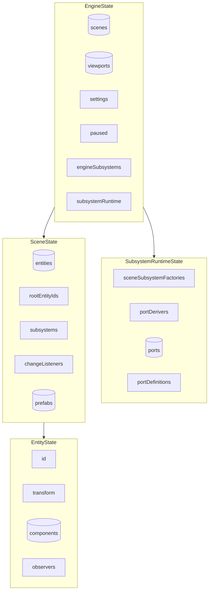
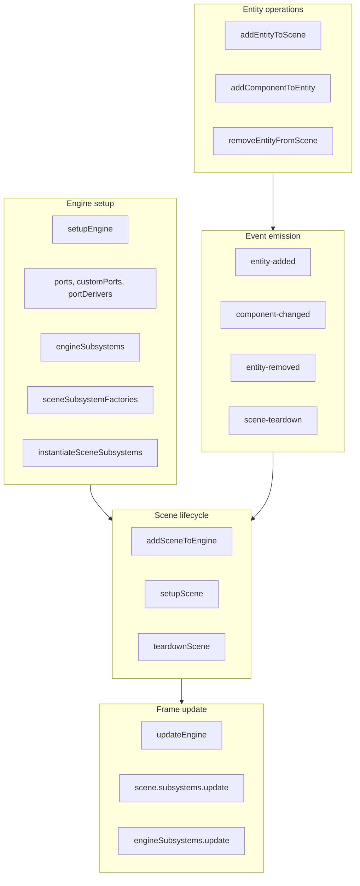
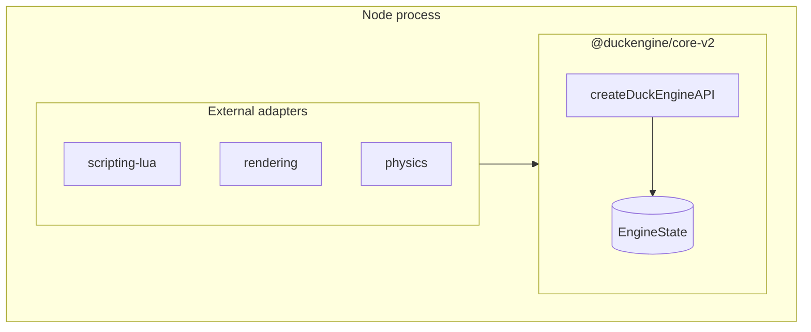
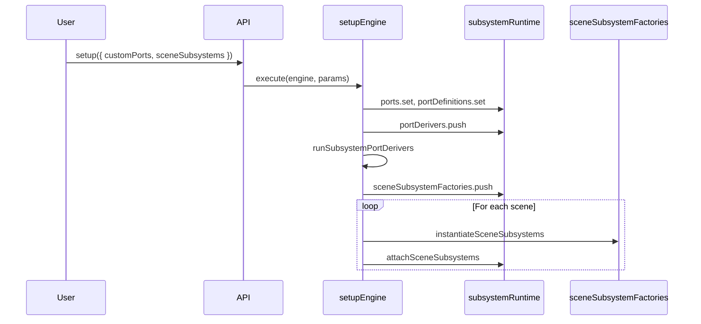
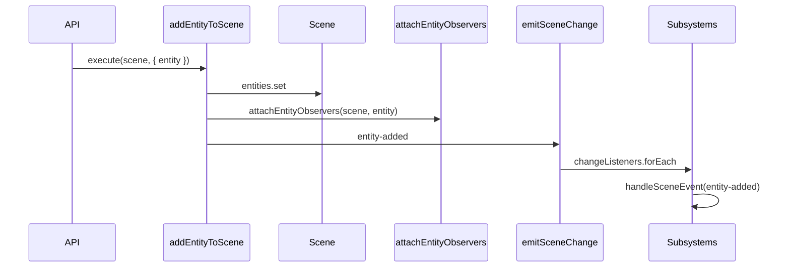
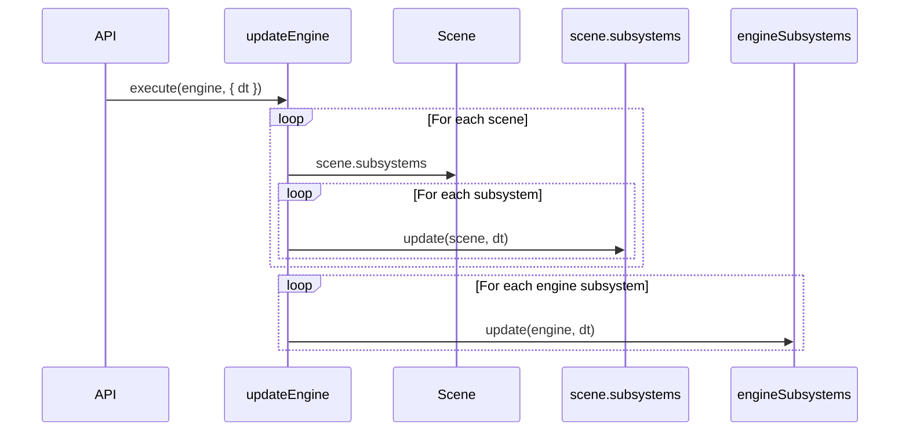
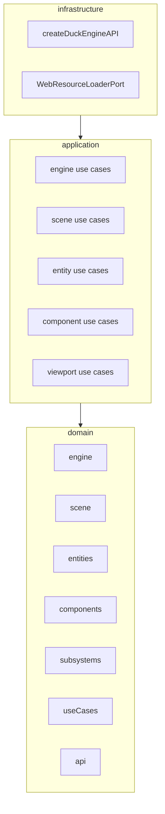

# @duckengine/core-v2 — Architecture (4+1 Model)

This document describes the actual architecture of the DuckEngine core using Kruchten's **4+1** model. The goal is to be honest about how the system is built today, not how it ideally should be.

---

## Role of core-v2

core-v2 is the **engine kernel**: it owns the ECS (entities, components, transforms), scene lifecycle, subsystem topology, and port registry. External packages (scripting-lua, rendering, physics) depend on it; core-v2 never depends on them. Consumers use `createDuckEngineAPI(engine)` to get a typed, fluent API surface.

---

## 4+1 Model: The Four Views + Scenarios

### Logical View

Main domain abstractions:



| Concept | Description |
|---------|-------------|
| **EngineState** | Root state: scenes, viewports, settings, paused, engineSubsystems, subsystemRuntime. |
| **SceneState** | Per-scene state: entities, rootEntityIds, activeCameraId, subsystems, changeListeners, prefabs, paused. |
| **EntityState** | ECS entity: id, transform, components, observers, children, parent, displayName, gizmoIcon. |
| **SubsystemRuntimeState** | Shared bag: sceneSubsystemFactories, portDerivers, ports, portDefinitions. |
| **SceneSubsystem** | Reacts to scene events (`handleSceneEvent`) and participates in frame updates (`update`). |
| **EngineSubsystem** | Cross-scene subsystem (e.g. render, audio); updates with full engine visibility. |
| **SubsystemPortRegistry** | Typed port lookup; ports are injected at setup or derived by portDerivers. |
| **PortDefinition / PortBinding** | `definePort(id).addMethod(name).build()` + `def.bind(impl)` for registration. |

**Event flow**: Entity observers (component add/remove/change, transform change) → `emitSceneChange` → `scene.changeListeners` (each subsystem is a listener) → `subsystem.handleSceneEvent`.

---

### Process View

Runtime execution flows:



**Event kinds**: `entity-added`, `entity-removed`, `component-changed`, `transform-changed`, `hierarchy-changed`, `active-camera-changed`, `scene-setup`, `scene-teardown`, `scene-debug-changed`, etc.

---

### Development View

Code organization:

```
src/
├── domain/                    # Pure logic, types, ports
│   ├── engine/                # EngineState, createEngine
│   ├── scene/                 # SceneState, emitSceneChange, sceneObservers, sceneValidation
│   ├── entities/              # EntityState, TransformState, addComponent, removeComponent
│   ├── components/            # ComponentBase, ComponentType, fieldPaths, validation
│   ├── subsystems/            # defineSceneSubsystem, definePort, composeSceneSubsystem,
│   │                          # SubsystemRuntimeState, port registry, runtime
│   ├── useCases/              # defineEngineUseCase, defineSceneUseCase, defineEntityUseCase,
│   │                          # defineComponentUseCase, defineViewportUseCase
│   ├── api/                   # composeAPI, APIComposer (fluent API builder)
│   ├── ids/                   # createSceneId, createEntityId, createViewportId
│   ├── math/                  # Vec3, Quat, Euler, utils
│   ├── viewport/              # ViewportState
│   ├── ports/                 # Port interfaces (EnginePorts, ResourceLoaderPort, etc.)
│   ├── scripting/             # Script schema, runtime context, API builders
│   ├── properties/            # Property validation
│   ├── prefabs/               # Prefab types
│   ├── resources/             # Resource refs, kinds
│   └── utils/                 # Result, ok, err
│
├── application/               # Use cases
│   ├── engine/                # setupEngine, updateEngine, addScene, removeScene,
│   │                          # addViewport, setPaused, registerSubsystem, etc.
│   ├── scene/                 # addEntity, removeEntity, setupScene, teardownScene,
│   │                          # updateScene, setActiveCamera, subscribe, etc.
│   ├── entity/                # addComponent, removeComponent, view, setDisplayName, etc.
│   ├── component/             # setEnabled, setField, snapshot
│   ├── viewport/              # setEnabled, setScene, setCamera, setCanvas, resize
│   ├── prefabs/               # addPrefab, removePrefab
│   └── ports/                 # fetchFile, resolveWebResource
│
└── infrastructure/            # Concrete API and port implementations
    ├── api/                   # createDuckEngineAPI (wires all use cases)
    └── ports/                 # WebResourceLoaderPort, etc.
```

**Dependency rule**:
- `domain` has zero external dependencies
- `application` imports from `domain` only
- `infrastructure` imports from `domain` and `application`

---

### Physical View



All state lives in memory. No built-in persistence. External adapters register as scene subsystems or engine subsystems and receive state via the API or port registry.

---

## Scenarios (+1): Application Layer Use Cases

This section documents **all** use cases in `src/application/`. Each use case is tagged with a domain (`engine`, `scene`, `entity`, `component`, `viewport`) and wired into the API via `createDuckEngineAPI` unless noted.

---

### Engine use cases

| Use case | API method | Params | Description |
|----------|------------|--------|-------------|
| **setupEngine** | `api.setup()` | `{ engineSubsystems?, sceneSubsystems?, ports?, customPorts?, portDerivers? }` | Composition root: registers ports, port derivers, engine subsystems, scene subsystem factories. Applies factories to existing scenes. |
| **addSceneToEngine** | `api.addScene()` | `{ sceneId }` | Creates a scene, registers it, instantiates and attaches scene subsystems. Returns `Result<SceneState>`. |
| **removeSceneFromEngine** | `api.removeScene()` | `{ sceneId }` | Removes a scene. Fails if any viewport references it. Does not call teardown. |
| **addViewport** | `api.addViewport()` | `{ id, sceneId, cameraEntityId, canvasId, rect?, enabled? }` | Creates a viewport. Validates scene exists and camera entity has `cameraView`. Returns `Result<ViewportState>`. |
| **removeViewport** | `api.removeViewport()` | `{ viewportId }` | Removes a viewport from the engine. |
| **setEnginePaused** | `api.setPaused()` | `{ paused }` | Sets `engine.paused`. When true, only subsystems with `updateWhenPaused` run. |
| **registerEngineSubsystem** | `api.registerSubsystem()` | `{ subsystem }` | Appends an engine subsystem to the update pipeline. |
| **updateEngine** | `api.update()` | `{ dt }` | Advances one frame: updates all scenes (scene subsystems), then engine subsystems. |
| **updateSettings** | `api.updateSettings()` | `{ patch: { graphics?, gameplay?, audio? } }` | Shallow-merges patch into `engine.settings`. Returns the resulting `GameSettings`. |
| **getSettings** | `api.getSettings()` | — | Returns current `GameSettings`. |
| **listScenes** | `api.listScenes()` | — | Returns `SceneView[]` (readonly snapshots). |
| **listViewports** | `api.listViewports()` | — | Returns `ViewportView[]`. |

---

### Scene use cases

| Use case | API method | Params | Description |
|----------|------------|--------|-------------|
| **addEntityToScene** | `scene.addEntity()` | `{ entity }` | Adds entity and subtree. Validates uniqueInScene, hierarchy. Attaches observers, emits `entity-added`. Returns `Result<EntityView>`. |
| **removeEntityFromScene** | `scene.removeEntity()` | `{ entityId }` | Removes entity and subtree. Emits `entity-removed`, runs cleanups. |
| **reparentEntityInScene** | `scene.reparentEntity()` | `{ childId, newParentId }` | Moves entity to new parent. `newParentId: null` promotes to root. Validates cycle, hierarchy. Emits `hierarchy-changed`. |
| **setActiveCamera** | `scene.setActiveCamera()` | `{ entityId }` | Sets or clears active camera. Entity must have `cameraView`. Emits `active-camera-changed`. |
| **toggleSceneDebug** | `scene.toggleDebug()` | `{ kind, enabled }` | Sets debug flag for `transform`, `mesh`, `collider`, `camera`. Emits `scene-debug-changed` etc. |
| **setupScene** | `scene.setupScene()` | `{ subsystems? }` | Attaches optional subsystems, emits `scene-setup`. |
| **teardownScene** | `scene.teardownScene()` | — | Emits `scene-teardown`, disposes subsystems, detaches observers, clears state. |
| **updateScene** | `scene.updateScene()` | `{ dt }` | Runs `scene.subsystems.update(scene, dt)` in order. |
| **setScenePaused** | `scene.setPaused()` | `{ paused }` | Sets `scene.paused`. |
| **subscribeToSceneChanges** | `scene.subscribe()` | `{ listener: (ev) => void }` | Adds listener to `changeListeners`. Returns unsubscribe function. |
| **listEntities** | `scene.listEntities()` | — | Returns `EntityView[]` for root entities only. |
| **addPrefab** | *(not in API)* | `{ prefabId, entity }` | Adds entity to `scene.prefabs`. Emits `prefab-added`. Used by instantiation infra. |
| **removePrefab** | *(not in API)* | `{ prefabId }` | Removes prefab from cache. Emits `prefab-removed` if existed. |

---

### Entity use cases

| Use case | API method | Params | Description |
|----------|------------|--------|-------------|
| **addComponentToEntity** | `entity.addComponent()` | `{ component }` | Adds component. Domain validates uniqueness, conflicts, hierarchy. Emits `component-changed`. |
| **removeComponentFromEntity** | `entity.removeComponent()` | `{ componentType }` | Removes component by type. Domain validates hierarchy. Emits `component-changed`. |
| **getEntityView** | `entity.view()` | — | Returns `EntityView` (readonly snapshot). |
| **setEntityDisplayName** | `entity.setDisplayName()` | `{ displayName: string }` | Sets entity display name. Emits presentation change. |
| **setEntityGizmoIcon** | `entity.setGizmoIcon()` | `{ gizmoIcon?: string }` | Sets gizmo icon for editor. |
| **setEntityDebugEnabled** | `entity.setDebug()` | `{ kind: DebugKind, enabled: boolean }` | Sets per-entity debug flag. |
| **listEntityChildren** | `entity.listChildren()` | — | Returns `EntityView[]` for direct children only. |

---

### Component use cases

| Use case | API method | Params | Description |
|----------|------------|--------|-------------|
| **setEnabled** | `component.setEnabled()` | `{ enabled }` | Sets `component.enabled`. |
| **setComponentField** | `component.setField()` | `{ fieldKey, value }` | Sets a single inspector field (supports dot-notation). Validates against inspector metadata. |
| **getComponentSnapshot** | `component.snapshot()` | — | Returns frozen readonly snapshot of component. |

---

### Viewport use cases

| Use case | API method | Params | Description |
|----------|------------|--------|-------------|
| **setViewportEnabled** | `viewport.setEnabled()` | `{ enabled: boolean }` | Enables or disables the viewport. |
| **setViewportScene** | `viewport.setScene()` | `{ sceneId }` | Changes which scene the viewport renders. Guard: scene must exist. |
| **setViewportCamera** | `viewport.setCamera()` | `{ cameraEntityId }` | Sets the camera entity. Guard: camera must exist in scene. |
| **setViewportCanvas** | `viewport.setCanvas()` | `{ canvasId }` | Sets the target canvas element ID. |
| **resizeViewport** | `viewport.resize()` | `{ rect: Partial<ViewportRect> }` | Merges rect into viewport.rect (x, y, width, height). |

---

### Port use cases (not in main API)

| Use case | Used by | Description |
|----------|---------|-------------|
| **fetchFile** | `ResourceLoaderPort` impl | Fetches a file by URL. Caches by `url::format`. Used by scripting/resource loading. |
| **resolveWebResource** | `ResourceLoaderPort` impl | Resolves a resource via EngineService API. Caches by `key@version`. |

---

### Key flows (sequence diagrams)

#### Engine setup



#### Add entity → subsystem reacts



#### Add component → component-changed

1. `entity.addComponent({ component })` → `addComponentToEntity` → domain `addComponent`
2. Entity observers fire → `emitSceneChange(component-changed)`
3. Scene change listeners (subsystems) receive the event
4. scripting-lua's `reconcileSlots` handles `component-changed` for `script` type → initScriptSlot

#### Update frame



#### Scene teardown

1. `scene.teardownScene()` → `teardownScene`
2. `emitSceneChange(scene-teardown)` → subsystems receive event
3. For each subsystem: `subsystem.dispose()`
4. Entity cleanups run (detach observers)
5. entities, rootEntityIds, changeListeners cleared

---

## Dependency Summary



---

## Notes

> Caveats and implementation details that may surprise developers.

**API composition** — The DuckEngine API is built by `composeAPI(engine).add(...).build()`. Each use case is tagged with a domain (`engine`, `scene`, `entity`, `component`, `viewport`). The composer resolves state by domain (e.g. `scene(sceneId)` → SceneState, `entity(entityId)` → EntityState) and binds use cases to that state. Guards run before execution.

**Scene subsystems vs engine subsystems** — Scene subsystems are per-scene, receive scene events, and update with `(scene, dt)`. Engine subsystems are global, receive no events, and update with `(engine, dt)`. Both are registered at setup.

**Port derivation** — Ports can be injected statically (`customPorts`, `ports`) or derived by `portDerivers` that run during setup. Derivers receive `{ engine, ports }` and can call `ports.register(def, impl)`.

**Entity observers** — Each entity has an `EntityObservers` hub. When a component is added/removed/changed or the transform changes, observers fire. `attachEntityObservers` wires these to `emitSceneChange`, so subsystems react to ECS mutations without polling.
