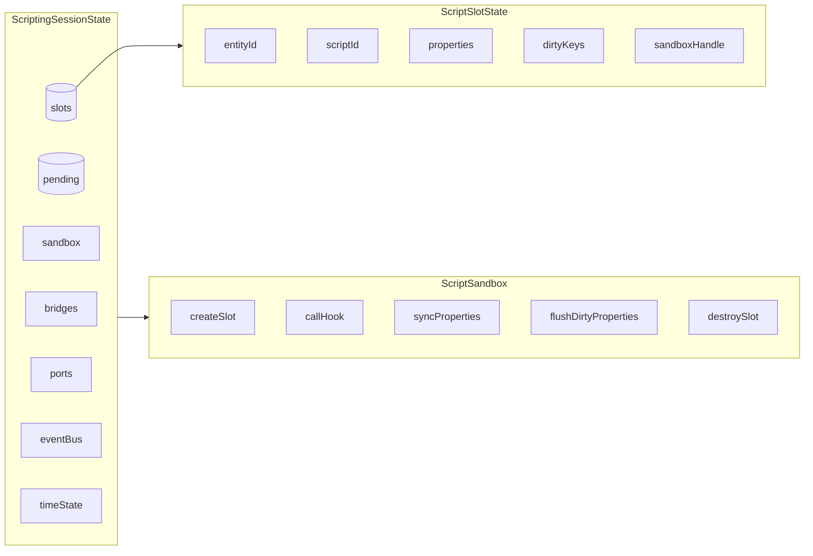
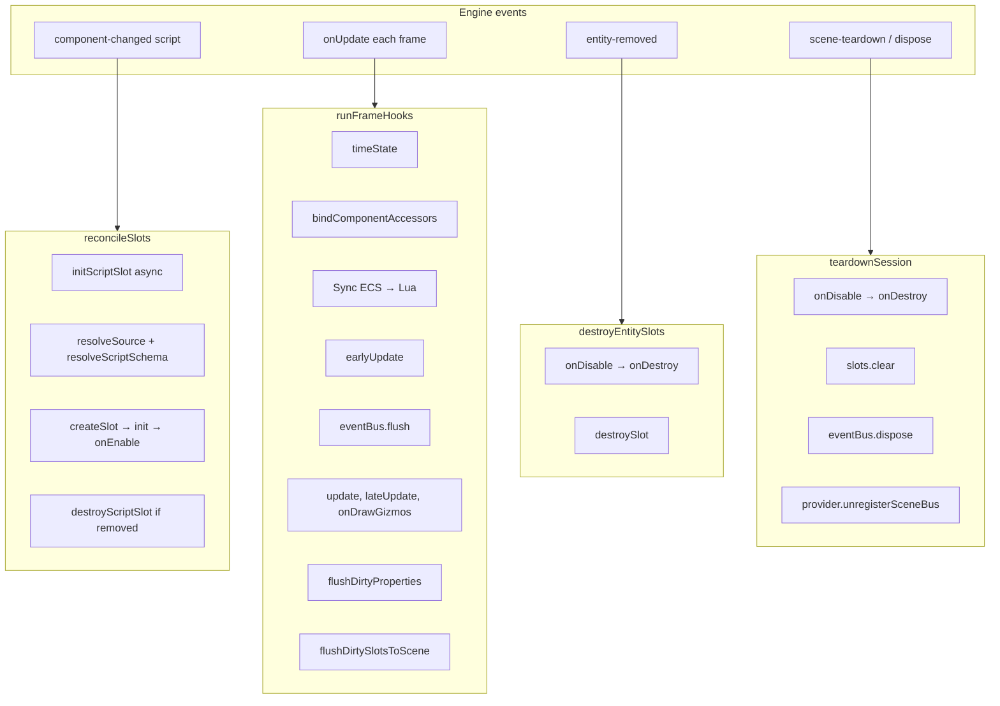
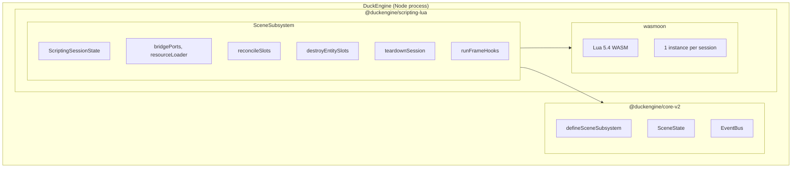
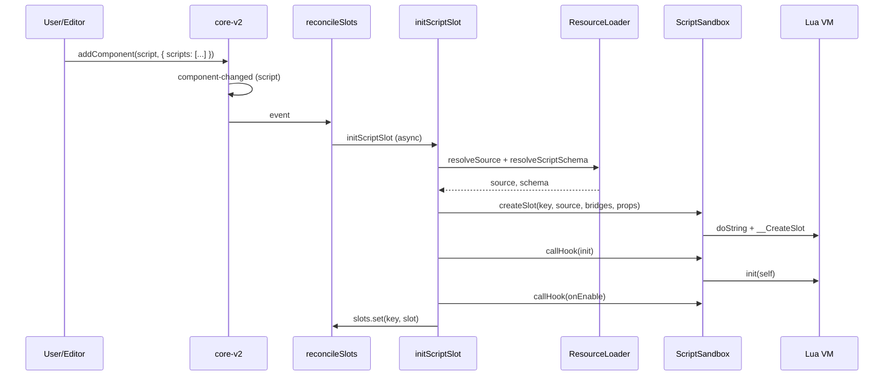
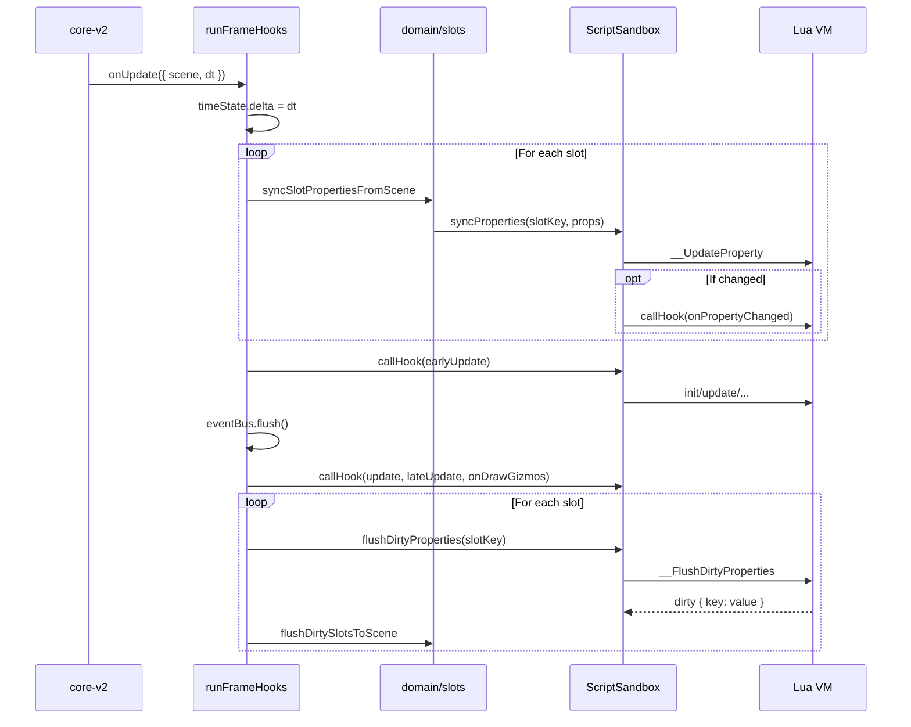
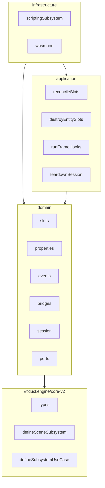

# @duckengine/scripting-lua — Architecture (4+1 Model)

This document describes the actual architecture of the Lua scripting subsystem using Kruchten's **4+1** model. The goal is to be honest about how the system is built today, not how it ideally should be.

---

## Relationship with core-v2

This package is a **scene subsystem adapter** (SceneSubsystem). It depends on `@duckengine/core-v2`; core-v2 never depends on it. It registers as a scene subsystem via `defineSceneSubsystem` and connects to the engine lifecycle through events and `onUpdate`.

**Ports from core**: `SceneEventBusProviderPort` (internal, auto-registered) provides the event bus per scene via `getOrCreateEventBus(sceneId)`. `UISlotOperationsPort` (internal) enables `Scene.addUISlot`, `removeUISlot`, `updateUISlot` from Lua. Both are available after `api.setup()`.

---

## 4+1 Model: The Four Views + Scenarios

### Logical View

Main domain abstractions:



| Concept | Description |
|---------|-------------|
| **ScriptSlotState** | State of a script instance: entityId, scriptId, properties, dirtyKeys, sandboxHandle, declared hooks. |
| **ScriptSandbox** | Port that abstracts Lua execution (createSlot, callHook, syncProperties, flushDirtyProperties, destroySlot). |
| **ScriptBridgeContext** | Context injected per slot: Transform, Scene, Script, references, etc. |
| **BridgeDeclaration** | Factory that creates a bridge from ports and state (inputBridge, physicsBridge, gizmoBridge, timeBridge, etc.). |
| **SceneEventBus** | In-frame event bus for script-to-script communication (fire/on, flush). Provided by core's `SceneEventBusProviderPort.getOrCreateEventBus(sceneId)`. |
| **ScriptingSessionState** | Global session state: slots, pending, sandbox, bridges, ports, eventBus, sceneId, sceneEventBusProvider, timeState, resolvers. |

**Entity-scoped bridges**: Transform, Scene, Script are scoped per entityId. Input, Gizmo, Physics, Time are global and live in `Engine.*`.

**BridgePorts**: Resolved from `SubsystemRuntimeState` at session init. Includes `physicsQuery`, `gizmo`, `input`, `uiSlotOperations`. `uiSlotOperations` is an internal port (core provides default); scripting gets it after `api.setup()`.

**Custom ports**: `engine_ports['port-id']` is resolved from `SubsystemRuntimeState` (portDefinitions + ports). Async methods accept a callback as the last argument: `callback(err, result)`.

---

### Process View

Runtime execution flows:



**Note**: `syncProperties` is an exported use case but is not wired to the subsystem lifecycle. The actual ECS → Lua sync happens inside `runFrameHooks`. `syncProperties` is useful for tests or manual invocation.

---

### Development View

Code organization:

```
src/
├── domain/                    # Business logic, types, ports
│   ├── slots/                 # ScriptSlotState, createScriptSlot, initScriptSlot,
│   │                          # destroyScriptSlot, runHookOnAllSlots, syncSlotPropertiesFromScene,
│   │                          # flushDirtySlotsToScene, slotKey
│   ├── properties/            # diffProperties, applyPropertyChanges, normalizePropertyValue
│   ├── bridges/               # BridgeDeclaration, factory, resolveRuntimeBridgeTable (engine_ports)
│   │   ├── inputBridge, physicsBridge, gizmoBridge, timeBridge, transformBridge,
│   │   ├── sceneBridge, scriptsBridge, bridgeContext
│   ├── session/               # initializeScriptRuntime, createScriptingSession,
│   │                          # ScriptingSessionState (eventBus, sceneId, sceneEventBusProvider)
│   ├── ports/                 # ScriptSandbox (interface)
│   ├── componentAccessors/    # createComponentAccessorPair (ECS getter/setter)
│   ├── schemas/               # builtInSchemas
│   └── subsystems/            # defineSubsystemUseCase (local)
│
├── application/               # Use cases
│   ├── reconcileSlots        # component-changed → init/destroy slots
│   ├── destroyEntitySlots    # entity-removed → destroy slots
│   ├── runFrameHooks          # onUpdate → hook pipeline + sync
│   ├── syncProperties         # (standalone) ECS → Lua for all slots
│   └── teardownSession        # scene-teardown / dispose → full cleanup
│
└── infrastructure/            # Concrete implementations
    ├── scriptingSubsystem.ts  # createScriptingSubsystem → defineSceneSubsystem
    ├── wasmoon/               # createWasmoonSandbox (Lua 5.4 via WASM)
    │   ├── wasmoonSandbox.ts  # Implements ScriptSandbox
    │   ├── modules/           # sandboxSecurity, sandboxMetatables, sandboxRuntime, mathExt
    │   └── luaUtils.ts        # callLuaGlobal
    ├── resourceScriptResolver.ts
    ├── createBuiltInScriptResolver.ts
    ├── createBuiltInScriptSchemaResolver.ts
    └── builtin/               # move_to_point, waypoint_path
```

**Dependency rule**:
- `domain` does not import from `application` or `infrastructure`
- `application` does not import from `infrastructure`
- `infrastructure` imports from `domain` and `application`

---

### Physical View



---

## Scenarios (+1): Use Cases

Scenarios tie the views together and explain the system's behavior.

### UC-1: Entity with script added to scene

1. User adds a `script` component with `scripts: [{ scriptId, enabled, properties }]`
2. core-v2 emits `component-changed` (script)
3. `reconcileSlots` receives the event
4. For each new script: `initScriptSlot` (async)
   - `resolveSource(scriptId)` and `resolveScriptSchema(scriptId)` (ResourceLoader or builtin)
   - `createScriptSlot` + `sandbox.createSlot` (compiles Lua, creates context)
   - `sandbox.callHook(key, 'init', 0)` and `sandbox.callHook(key, 'onEnable', 0)`
5. Slot is stored in `slots` and ready for the next frame



### UC-2: Update frame

1. core-v2 calls the subsystem's `onUpdate` with `{ scene, dt }`
2. `runFrameHooks` executes:
   - Updates `timeState`
   - `syncSlotPropertiesFromScene`: diff ECS vs slot.properties → `sandbox.syncProperties` → `onPropertyChanged` if changed
   - `runHookOnAllSlots('earlyUpdate', dt)`
   - `eventBus.flush()` (delivers queued events)
   - `runHookOnAllSlots('update', dt)`, `lateUpdate`, `onDrawGizmos`
   - `sandbox.flushDirtyProperties` → `flushDirtySlotsToScene` (Lua → ECS)



### UC-3: Script calls async port with callback

1. In `init` or `update`, the script calls `engine_ports['game:api'].fetchData('id', function(err, data) ... end)`
2. `resolveRuntimeBridgeTable` exposes the method wrapped with `wrapAsyncWithCallback`
3. The wrapper detects 2+ args, uses the last as callback
4. `fn(id)` returns a `Promise` → `callback(undefined, result)` on resolve
5. The Lua callback runs in a microtask; writes to `self.properties`; the next frame flushes to ECS

### UC-4: Entity removed

1. core-v2 emits `entity-removed`
2. `destroyEntitySlots` receives the event
3. For each slot of the entity: `onDisable` → `onDestroy` → `sandbox.destroySlot` → `eventBus.removeSlot`
4. Slots removed from `slots`

### UC-5: Scene teardown

1. core-v2 emits `scene-teardown` or calls `dispose`
2. `teardownSession` executes
3. For each slot: `onDisable` → `onDestroy` → `sandbox.destroySlot`
4. `slots.clear()`, `eventBus.dispose()`
5. `sceneEventBusProvider.unregisterSceneBus(sceneId)` — releases the bus from the provider

---

## Dependency Summary



---

## Notes

> Caveats and implementation details that may surprise developers.

**syncProperties** — The `syncProperties` use case is exported but not wired to the subsystem lifecycle. The actual ECS → Lua sync happens inside `runFrameHooks` (step 3). Use `syncProperties` for tests or when you need to sync without running the full frame pipeline.

**Bridges** — Bridge declarations are pure factory functions in domain. Infrastructure calls them with the correct ports; bridges do not hold state or orchestrate workflows.

**engine_ports** — Custom ports are resolved at runtime from `SubsystemRuntimeState` (portDefinitions + port implementations). There are no static types per port for clients; each game extends `engine_ports_v2.d.lua` with its own port shapes.

**Lua VM** — One wasmoon (Lua 5.4) instance per session. All slots share the same VM; isolation is by `slotKey` (context tables, metatables), not by separate VMs.

**Event bus** — The event bus is `SceneEventBus` from core. scripting-lua obtains it via `SceneEventBusProviderPort.getOrCreateEventBus(sceneId)` at session init. On teardown, `unregisterSceneBus(sceneId)` is called so the provider can dispose the bus.
